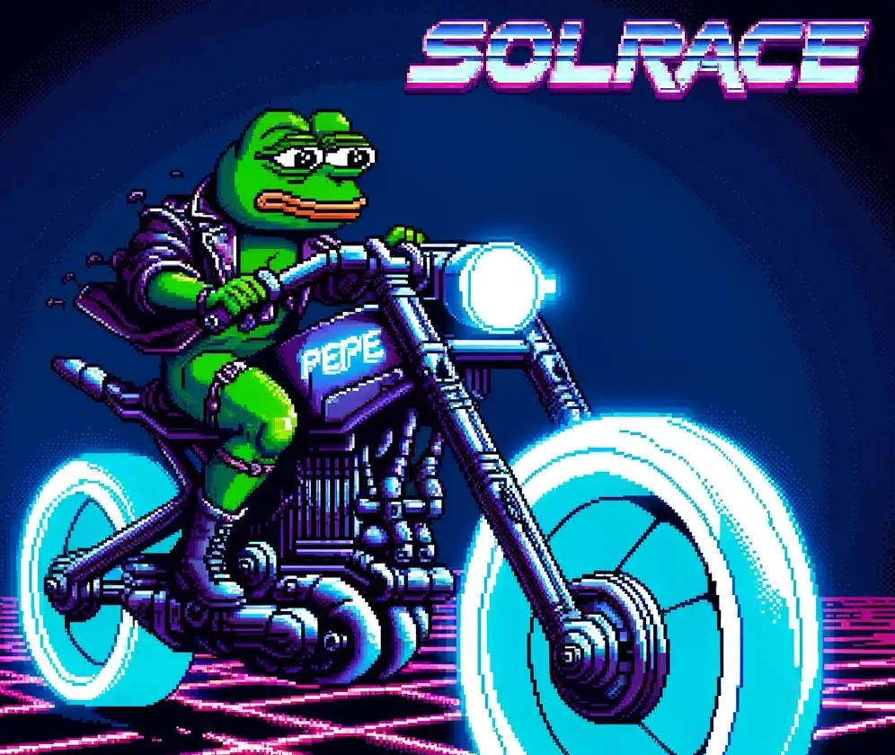

<div align="center">
  
  <h1>Solrace</h1>
  <p>
    <strong>Solana's Retro-Arcade Racing Battle Royale<a></strong>
  </p>
  <p>
    <a href="https://opensource.org/licenses/MIT"></a>
    <a href="https://discord.gg/PtAkTCwueu"></a>
  </p>
</div>

Solrace is a multiplayer racing battle-royale, inspired by the iconic 80's Tron game, classic Snake and Slither.io.

## Concept
- **Gameplay**: Players ride futuristic bikes that leave behind slowly-fading energy trails.
The objective is to outmaneuver opponents, leading them to crash into a trail or the grid's edge, and be the last one standing.
- **Elimination Mechanics**: A player is eliminated if they collide with another player's trail. The game is set on a square grid (default size is 256x256), with bikes moving at fixed speeds and capable of turning at 90-degree angles.
- **Customization**: Players can chose from multiple playable characters and trails. While these do not affect in-game characteristics sur as speed or trail length, it's cool.
- **Performance**: Solrace is WebGL-based and runs at 60 FPS, ensuring fairness among players.
- **Serveless Consensus**: The game operates without a central server. Players are interconnected through WebRTC, enabling real-time position tracking and consensus mechanisms for cheat and lag detection following a 66% vote (e.g., 7/10, 4/5, 3/4 or 2/3).
- **P2E, No BS**: Play to earn in its purest form. Stake to enter a game, race, share the game's pot.
Note that non-incentivized games have a negative expectancy (slightly below 1:1), the only way to earn is to beat your opponents.

## Game Lifecycle
- **Game Creation**: Any user with a Solana wallet can create a game in Solrace with custom settings or use default parameters. Once submitted to the blockchain along with the creator's entry ticket, the game is attributed a unique ID and adheres to the creator's specified rules. Games can be cancelled by the creator at any point before they start.
- **Game Joining**: To participate in Solrace, users join a game lobby and click "Enroll," which requires staking the game's $SOL ticket price.
- **Player Withdrawal**: Enrolled players can withdraw their staked $SOL as long as the game hasn't started, ensuring their ability to opt out.
- **Game Start**: Games automatically begin 10s after the final player enrolls. Alternatively, a game can be manually started by any player after at least two players have enrolled, pending acceptance from the other players.
- **Game Finish**: Solrace concludes when only one player remains, with others eliminated or disqualified for cheating or lag. It embraces the Battle Royale format to determine the victor.
- **Rewards Claiming**: The game pot, comprising all entry tickets and additional rewards, is available for claiming up to one hour after game creation. The distribution of the prize pool follows the game creator's scheme (e.g., winner-takes-all, top 3, etc.). If not claimed within one hour, players can reclaim their entry fee, preventing loss of funds.

## Consensus
- **Pre-elimination Signature**: When enrolling for a game, a user stakes the ticket price on the game contract but also locally stores a pre-signed message, agreeing to his elimination.
- **In-game Frequency**: Consensus between players is reached about 5x/s over WebRTC, confirming their positions on the grid using a fault-tolerant algorithm that checks if a players' data aligns with the game's parameters. 66% of players (e.g., 7/10, 4/5, 3/4 or 2/3) should agree on a state change for it to become the new synchronized shared state.
- **Anti-Cheat**: If a user is considered cheating, disconnects or lags excessively, he is kicked from the game following the above consensus.
- **Elimination Criteria**: Similar consensus must be reached for a player to be eliminated
- **Elimination Signature Propagation**: When a user is eliminated or kicked as per the shared state, he instantly shares his pre-signed message that was generated when they first enrolled in the game.
- **Reward Claiming**: These above collected signatures are submitted by a game's winners in order to claim their rewards.
A game's winner should be able to submit all other players elimination signatures, while the second can claim with one signature missing, the third one with two signatures missing, and so on.
- **Hazardeous Signature Propagation**: The above will occur if at least one user quits the game before being consensually eliminated, his signature not yet being shared. Such quitter needs to re-connect to the game for his client to propagate the signature to the other players for the win to be claimable.
- **Adversarial Outcomes**: In cases where in-game consensus cannot be achieved due to a corrupted state, the pot cannot be claimed.
In this scenario, or if a game's winner did not claim his rewards one hour after game creation, players can reclaim their entry ticket, mitigating loss of funds.

## Technical Specifications
- **Front-End**: Solrace leverages high-performance WebGL rendering and WebRTC for serverless, peer-to-peer state synchronization. This ensures the game runs smoothly at 60 FPS even on low-end hardware, maintaining fairness among players. WebRTC also facilitates continuous consensus for validating shared in-game states, like player positions, to efficiently identify cheats, lags, and eliminate players.
- **On-chain Security**: The management of games, ticket stakes, processing of fees, and distribution of pots are all handled on-chain. Game outcomes are securely recorded on Solana and Arweave, offering transparency and security. After reaching a consensus on game outcomes, in-game data is cleared, supporting a low-cost, fast, and trustless model for state management.
- **True Serverless Architecture**: By pioneering peer-to-peer in-game communication, Solrace avoids dependency on centralized servers for state synchronization and cheat detection. This approach minimizes points of failure and enhances security without compromising the player's experience.
- **Economic Model**: The blockchain manages entry fees, pot distribution, and reward claims, with systems in place to ensure fairness and prevent abuse. This economic model is designed to support a sustainable and engaging gaming environment for all participants.

# Data Model

The provided Rust code defines the data structures for players, game metrics, game parameters, game statuses, game parameters specific to each game, and the game entity itself. This model supports the game's decentralized architecture, including tracking wins, losses, earnings, player contributions to the game pot, and game outcomes.

```rust
#[derive(BorshSerialize, BorshDeserialize, Debug)]
pub struct Player {
    // global attributes
    pub wins: u32, // Number of games won
    pub losses: u32, // Number of games lost
    pub earnings: i128, // Sum of earnings in lamports (no support for SPL tokens)
    pub name: String, // Player defined name, defaults to (public key)[:8]
    pub title: String, // Player defined title, can only be set every 42 games (wins+losses) % 42 == 0
    pub picture: String, // Player defined URI pointing to a arweave/ipfs
    // in-game attributes
    pub game_id: Pubkey, // Game id of the game the player is currently in
    pub position: u64, // Grid position of the player in-game (empty for stateless, webrtc only games)
    pub creator_of: u32, // Game id of the current game created if any (a new game cannot be started by a player if his previous game is still pending)
}

#[derive(BorshSerialize, BorshDeserialize, Debug)]
pub struct Metrics {
    pub total_pot: u64, // Sum of all finished games' pots
    pub open_pot: u64, // Sum of all ongoing games' pots
    pub earningsLeaderboard: Vec<Pubkey>, // Top 10 players by earnings (only players with more than 42 games)
    pub winrateLeaderboard: Vec<Pubkey>, // Top 10 players by winrate (wins/games, only players with more than 42 games)
    pub earnings: u64, // Sum of all players' earnings
}

#[derive(BorshSerialize, BorshDeserialize, Debug)]
pub struct Params {
    pub admin: Pubkey, // Public key of the admin multisig (can pause and update these params)
    pub paused: bool, // Game global pausing - can new games be started
    pub next_game_id: u32, // Next game id to be used - reset to 0 after reaching u32::MAX to save space
    pub fee: u16, // Game ticket fee in bps (0-100_00)
    pub fee_collector: Pubkey, // Public key of the fee collector
    pub min_pot: u64, // Minimum pot size for a game to start
    pub max_pot: u64, // Max pot size for a game
    pub min_grid: u16, // Minimum size of the game grid
    pub max_grid: u16, // Max size of the game grid
    pub min_speed: u8, // Minimum speed of the bike in blocs per second
    pub max_speed: u8, // Max speed of the bike in blocs per second
    pub min_trail: u16, // Minimum trail length at the start of the game
    pub max_trail: u16, // Max trail length at the start of the game
    pub min_trail_cooldown: u8, // Min seconds before a trail increases +base_trail_length
    pub max_trail_cooldown: u8, // Max seconds before a trail increases +base_trail_length
    pub max_disconnects: u32, // Max number of disconnects before kick
    pub disconnect_max_sec: u32, // Max time in seconds a player can be disconnected before kick
}

#[derive(BorshSerialize, BorshDeserialize, Debug)]
pub enum GStatus {
    Pending, // Lobby is on, waiting for players to join
    Cancelled, // Game was cancelled by creator before starting
    Ongoing, // Game is currently being played or pot is still unclaimed
    Finished, // Game has finished for more than 10 minutes and a user withdrew or pot has been claimed by winner
}

#[derive(BorshSerialize, BorshDeserialize, Debug)]
pub struct GParams {
    pub max_players: u8, // Max number of players in the game
    pub min_players: u8, // Minimum number of players in the game
    pub split_between: u8, // How the pot is split among winners
    pub speed: u8, // Speed of the bike in blocs per second
    pub base_trail_length: u8, // Length of the trail left by the bike at the start of the game
    pub trail_cooldown: u8 // Seconds before a trail increases +base_trail_length
    pub grid_size: u16, // Size of the game grid (grid_size x grid_size)
    pub ticket_price: u64, // Price of a ticket to join the game
}

#[derive(BorshSerialize, BorshDeserialize, Debug)]
pub struct Game {
    pub id: u32, // Unique game identifier (incremental)
    pub creator: Pubkey, // The player who created the game
    pub params: GParams, // Parameters for the game
    pub players: Vec<GPlayer>, // Current players in the game
    pub pot: u64, // Current pot size (sum of all player tickets)
    pub status: GStatus, // Current status of the game
}
```